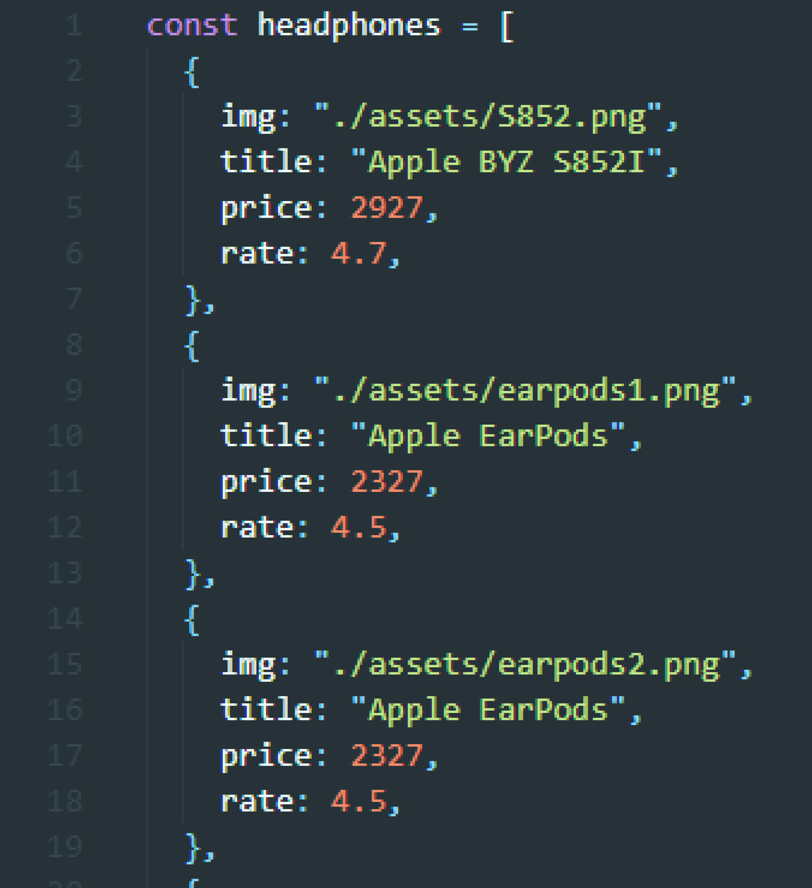

### Необходимо разработать две страницы интернет-магазина аудио аксессуаров.

Для запуска:

```
git clone https://github.com/Tars-Tarkas/neoflex.git
cd neoflex
npm install
npm run start
```

### Языки программирования и инструменты

<div id="badges" style='text-align:center; padding:30px' >
  
    
    
      
</div>

```
Первая страница – каталог товаров, вторая – корзина с приобретенными товарами.
Макет доступен по сылке: https://www.figma.com/file/bBkg5W8GRwGmhNCVeXevoN/Neoflex-Invite-Test?node-id=0%3A1
При нажатии на «Купить» в карточке на первой странице счетчик товаров рядом с иконкой корзины должен увеличиваться
```


```
При изменении количества товаров в корзине, сумма должна изменяться
```


```
Обязательным условием является хранение данных о каждом товаре в виде элемента массива,
например:
```



```
и подстановка данных в карточки товара из полученных данных этого массива.
Для передачи информации о выбранных в корзину позиций можно использовать SessionStorage.
```
